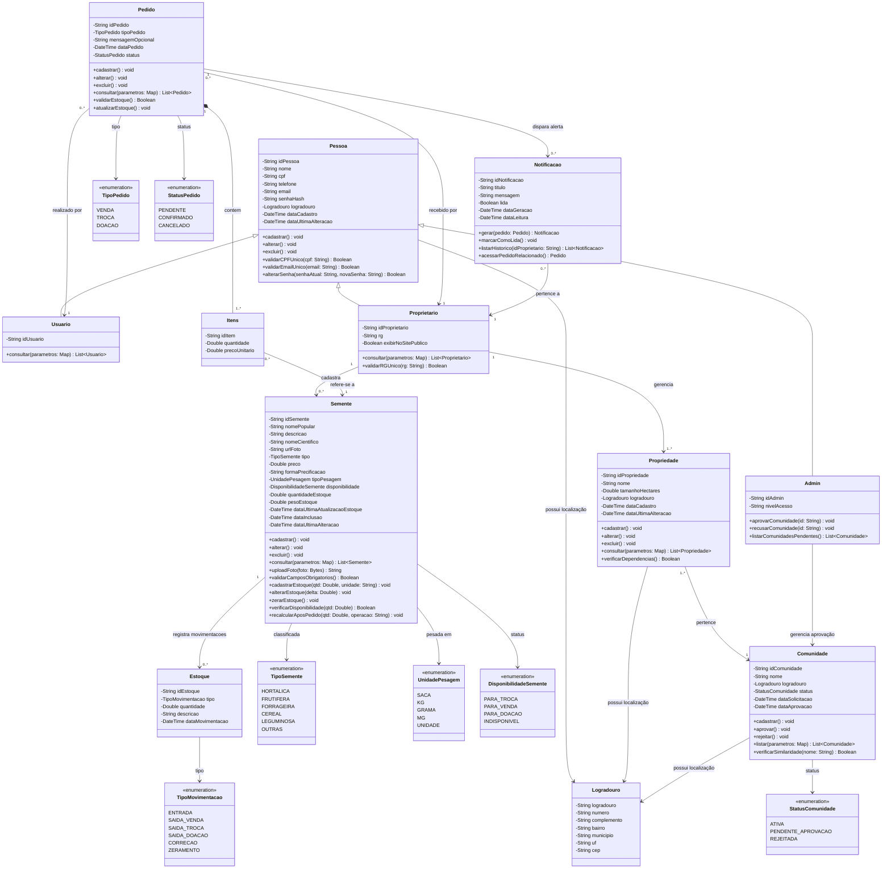

```mermaid
classDiagram
    direction TB

    class Pessoa {
        -String idPessoa
        -String nome
        -String cpf
        -String telefone
        -String email
        -String senhaHash
        -Logradouro logradouro
        -DateTime dataCadastro
        -DateTime dataUltimaAlteracao
        +cadastrar() void
        +alterar() void
        +excluir() void
        +validarCPFUnico(cpf: String) Boolean
        +validarEmailUnico(email: String) Boolean
        +alterarSenha(senhaAtual: String, novaSenha: String) Boolean
    }

    class Usuario {
        -String idUsuario
        +consultar(parametros: Map) List~Usuario~
    }

    class Proprietario {
        -String idProprietario
        -String rg
        -Boolean exibirNoSitePublico
        +consultar(parametros: Map) List~Proprietario~
        +validarRGUnico(rg: String) Boolean
    }

    class Admin {
        -String idAdmin
        -String nivelAcesso
        +aprovarComunidade(id: String) void
        +recusarComunidade(id: String) void
        +listarComunidadesPendentes() List~Comunidade~
    }

    class Logradouro {
        -String logradouro
        -String numero
        -String complemento
        -String bairro
        -String municipio
        -String uf
        -String cep
    }

    class Comunidade {
        -String idComunidade
        -String nome
        -Logradouro logradouro
        -StatusComunidade status
        -DateTime dataSolicitacao
        -DateTime dataAprovacao
        +cadastrar() void
        +aprovar() void
        +rejeitar() void
        +listar(parametros: Map) List~Comunidade~
        +verificarSimilaridade(nome: String) Boolean
    }

    class StatusComunidade {
        <<enumeration>>
        ATIVA
        PENDENTE_APROVACAO
        REJEITADA
    }

    class Propriedade {
        -String idPropriedade
        -String nome
        -Double tamanhoHectares
        -Logradouro logradouro
        -DateTime dataCadastro
        -DateTime dataUltimaAlteracao
        +cadastrar() void
        +alterar() void
        +excluir() void
        +consultar(parametros: Map) List~Propriedade~
        +verificarDependencias() Boolean
    }

    class Semente {
        -String idSemente
        -String nomePopular
        -String descricao
        -String nomeCientifico
        -String urlFoto
        -TipoSemente tipo
        -Double preco
        -String formaPrecificacao
        -UnidadePesagem tipoPesagem
        -DisponibilidadeSemente disponibilidade
        -Double quantidadeEstoque
        -Double pesoEstoque
        -DateTime dataUltimaAtualizacaoEstoque
        -DateTime dataInclusao
        -DateTime dataUltimaAlteracao
        +cadastrar() void
        +alterar() void
        +excluir() void
        +consultar(parametros: Map) List~Semente~
        +uploadFoto(foto: Bytes) String
        +validarCamposObrigatorios() Boolean
        +cadastrarEstoque(qtd: Double, unidade: String) void
        +alterarEstoque(delta: Double) void
        +zerarEstoque() void
        +verificarDisponibilidade(qtd: Double) Boolean
        +recalcularAposPedido(qtd: Double, operacao: String) void
    }

    class TipoSemente {
        <<enumeration>>
        HORTALICA
        FRUTIFERA
        FORRAGEIRA
        CEREAL
        LEGUMINOSA
        OUTRAS
    }

    class UnidadePesagem {
        <<enumeration>>
        SACA
        KG
        GRAMA
        MG
        UNIDADE
    }

    class DisponibilidadeSemente {
        <<enumeration>>
        PARA_TROCA
        PARA_VENDA
        PARA_DOACAO
        INDISPONIVEL
    }

    class Estoque {
        -String idEstoque
        -TipoMovimentacao tipo
        -Double quantidade
        -String descricao
        -DateTime dataMovimentacao
    }

    class TipoMovimentacao {
        <<enumeration>>
        ENTRADA
        SAIDA_VENDA
        SAIDA_TROCA
        SAIDA_DOACAO
        CORRECAO
        ZERAMENTO
    }

    class Pedido {
        -String idPedido
        -TipoPedido tipoPedido
        -String mensagemOpcional
        -DateTime dataPedido
        -StatusPedido status
        +cadastrar() void
        +alterar() void
        +excluir() void
        +consultar(parametros: Map) List~Pedido~
        +validarEstoque() Boolean
        +atualizarEstoque() void
    }

    class Itens {
        -String idItem
        -Double quantidade
        -Double precoUnitario
    }

    class TipoPedido {
        <<enumeration>>
        VENDA
        TROCA
        DOACAO
    }

    class StatusPedido {
        <<enumeration>>
        PENDENTE
        CONFIRMADO
        CANCELADO
    }

    class Notificacao {
        -String idNotificacao
        -String titulo
        -String mensagem
        -Boolean lida
        -DateTime dataGeracao
        -DateTime dataLeitura
        +gerar(pedido: Pedido) Notificacao
        +marcarComoLida() void
        +listarHistorico(idProprietario: String) List~Notificacao~
        +acessarPedidoRelacionado() Pedido
    }

    %% Herança
    Pessoa <|-- Usuario
    Pessoa <|-- Proprietario
    Pessoa <|-- Admin

    %% Logradouro
    Pessoa --> Logradouro : possui localização
    Propriedade --> Logradouro : possui localização
    Comunidade --> Logradouro : possui localização

    %% Proprietario
    Proprietario "1" --> "1..*" Propriedade : gerencia
    Propriedade "1..*" --> "1" Comunidade : pertence
    Comunidade --> StatusComunidade : status

    %% Admin
    Admin --> Comunidade : gerencia aprovação

    %% Semente
    Proprietario "1" --> "0..*" Semente : cadastra
    Semente --> TipoSemente : classificada
    Semente --> DisponibilidadeSemente : status
    Semente --> UnidadePesagem : pesada em
    Semente "1" --> "0..*" Estoque : registra movimentacoes
    Estoque --> TipoMovimentacao : tipo

    %% Pedido
    Pedido "1" *-- "1..*" Itens : contem
    Itens "0..*" --> "1" Semente : refere-se a
    Pedido "0..*" --> "1" Usuario : realizado por
    Pedido "0..*" --> "1" Proprietario : recebido por
    Pedido --> TipoPedido : tipo
    Pedido --> StatusPedido : status
    Pedido "1" --> "0..*" Notificacao : dispara alerta
    Notificacao "0..*" --> "1" Proprietario : pertence a
```