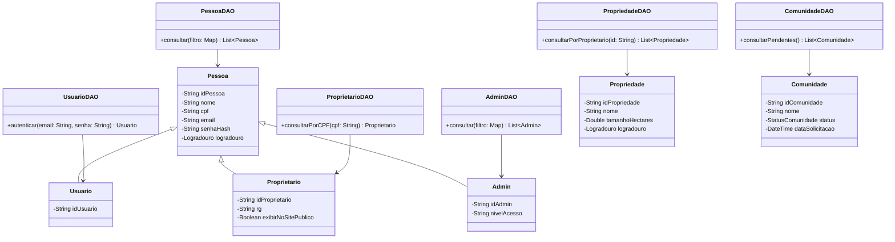
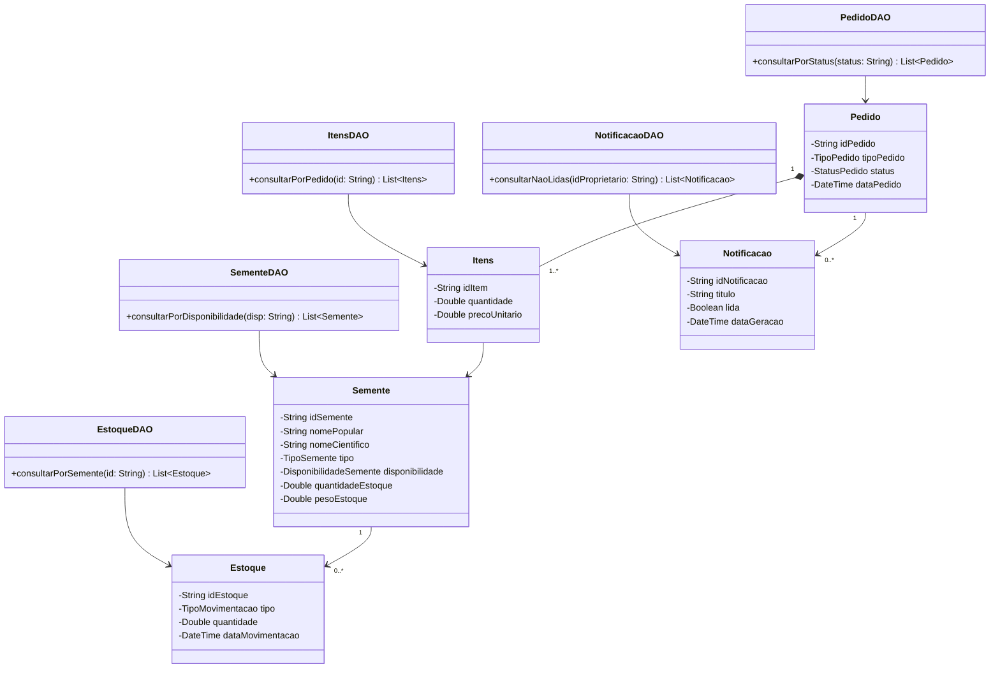

# Diagramas DAO

## Diagrama 1 — Arquitetura de DAOs (Singleton)

```mermaid
classDiagram
    direction LR

    class InterfaceDAO~T~ {
        <<interface>>
        +adicionar(obj: T) void
        +alterar(obj: T) void
        +excluir(obj: T) void
        +consultar(filtro: Map) List~T~
    }

    class Conexao {
        -static Conexao instancia
        -Connection conn
        -Conexao()
        +static getInstance() Conexao
        +getConnection() Connection
        +closeConn() void
    }

    class PessoaDAO {
        -String sql
        -Connection conn
        +adicionar(obj: Pessoa) void
        +alterar(obj: Pessoa) void
        +excluir(obj: Pessoa) void
        +consultar(filtro: Map) List~Pessoa~
    }

    class UsuarioDAO {
        -String sql
        -Connection conn
        +adicionar(obj: Usuario) void
        +alterar(obj: Usuario) void
        +excluir(obj: Usuario) void
        +consultar(filtro: Map) List~Usuario~
        +autenticar(email: String, senha: String) Usuario
    }

    class ProprietarioDAO {
        -String sql
        -Connection conn
        +adicionar(obj: Proprietario) void
        +alterar(obj: Proprietario) void
        +excluir(obj: Proprietario) void
        +consultar(filtro: Map) List~Proprietario~
        +consultarPorCPF(cpf: String) Proprietario
        +consultarPorEmail(email: String) Proprietario
    }

    class AdminDAO {
        -String sql
        -Connection conn
        +adicionar(obj: Admin) void
        +alterar(obj: Admin) void
        +excluir(obj: Admin) void
        +consultar(filtro: Map) List~Admin~
    }

    class PropriedadeDAO {
        -String sql
        -Connection conn
        +adicionar(obj: Propriedade) void
        +alterar(obj: Propriedade) void
        +excluir(obj: Propriedade) void
        +consultar(filtro: Map) List~Propriedade~
        +consultarPorProprietario(id: String) List~Propriedade~
    }

    class ComunidadeDAO {
        -String sql
        -Connection conn
        +adicionar(obj: Comunidade) void
        +alterar(obj: Comunidade) void
        +excluir(obj: Comunidade) void
        +consultar(filtro: Map) List~Comunidade~
        +consultarPendentes() List~Comunidade~
        +consultarPorNome(nome: String) List~Comunidade~
    }

    class SementeDAO {
        -String sql
        -Connection conn
        +adicionar(obj: Semente) void
        +alterar(obj: Semente) void
        +excluir(obj: Semente) void
        +consultar(filtro: Map) List~Semente~
        +consultarPorProprietario(id: String) List~Semente~
        +consultarPorDisponibilidade(disp: String) List~Semente~
    }

    class EstoqueDAO {
        -String sql
        -Connection conn
        +adicionar(obj: Estoque) void
        +alterar(obj: Estoque) void
        +excluir(obj: Estoque) void
        +consultar(filtro: Map) List~Estoque~
        +consultarPorSemente(id: String) List~Estoque~
    }

    class PedidoDAO {
        -String sql
        -Connection conn
        +adicionar(obj: Pedido) void
        +alterar(obj: Pedido) void
        +excluir(obj: Pedido) void
        +consultar(filtro: Map) List~Pedido~
        +consultarPorProprietario(id: String) List~Pedido~
        +consultarPorUsuario(id: String) List~Pedido~
        +consultarPorStatus(status: String) List~Pedido~
    }

    class ItensDAO {
        -String sql
        -Connection conn
        +adicionar(obj: Itens) void
        +alterar(obj: Itens) void
        +excluir(obj: Itens) void
        +consultar(filtro: Map) List~Itens~
        +consultarPorPedido(id: String) List~Itens~
    }

    class NotificacaoDAO {
        -String sql
        -Connection conn
        +adicionar(obj: Notificacao) void
        +alterar(obj: Notificacao) void
        +excluir(obj: Notificacao) void
        +consultar(filtro: Map) List~Notificacao~
        +consultarNaoLidas(idProprietario: String) List~Notificacao~
        +marcarComoLida(id: String) void
    }

    InterfaceDAO~T~ <|.. PessoaDAO
    InterfaceDAO~T~ <|.. UsuarioDAO
    InterfaceDAO~T~ <|.. ProprietarioDAO
    InterfaceDAO~T~ <|.. AdminDAO
    InterfaceDAO~T~ <|.. PropriedadeDAO
    InterfaceDAO~T~ <|.. ComunidadeDAO
    InterfaceDAO~T~ <|.. SementeDAO
    InterfaceDAO~T~ <|.. EstoqueDAO
    InterfaceDAO~T~ <|.. PedidoDAO
    InterfaceDAO~T~ <|.. ItensDAO
    InterfaceDAO~T~ <|.. NotificacaoDAO

    PessoaDAO --> Conexao
    UsuarioDAO --> Conexao
    ProprietarioDAO --> Conexao
    AdminDAO --> Conexao
    PropriedadeDAO --> Conexao
    ComunidadeDAO --> Conexao
    SementeDAO --> Conexao
    EstoqueDAO --> Conexao
    PedidoDAO --> Conexao
    ItensDAO --> Conexao
    NotificacaoDAO --> Conexao
```

---

## Diagrama 2 — DAOs × Models (pessoas e propriedades)

---

## Diagrama 3 — DAOs × Models (sementes, pedidos e notificações)

