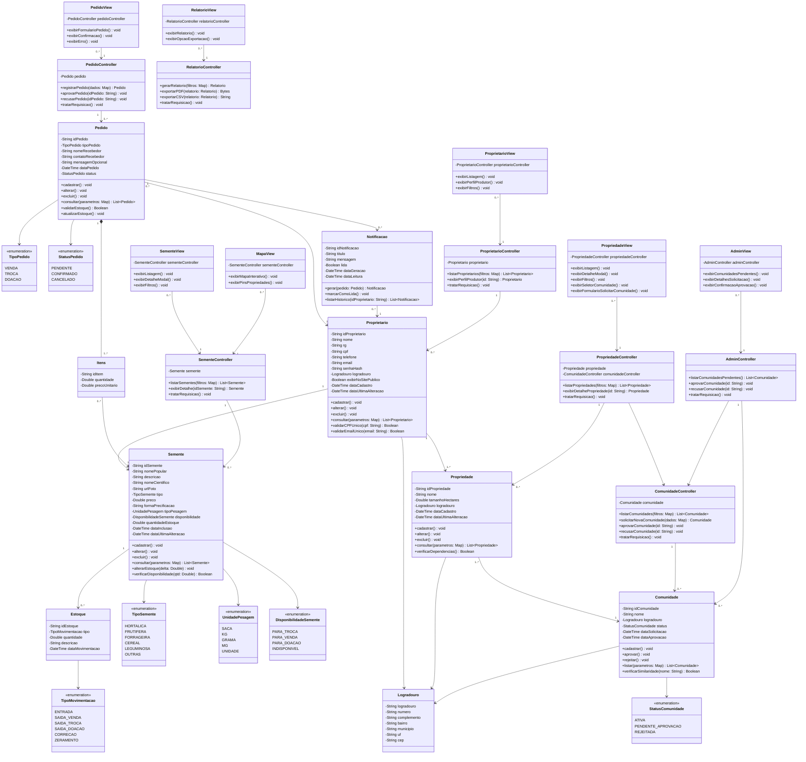

```mermaid
classDiagram
    direction TB

    class Logradouro {
        -String logradouro
        -String numero
        -String complemento
        -String bairro
        -String municipio
        -String uf
        -String cep
    }

    class Comunidade {
        -String idComunidade
        -String nome
        -Logradouro logradouro
        -StatusComunidade status
        -DateTime dataSolicitacao
        -DateTime dataAprovacao
        +cadastrar() void
        +aprovar() void
        +rejeitar() void
        +listar(parametros: Map) List~Comunidade~
        +verificarSimilaridade(nome: String) Boolean
    }

    class StatusComunidade {
        <<enumeration>>
        ATIVA
        PENDENTE_APROVACAO
        REJEITADA
    }

    class Proprietario {
        -String idProprietario
        -String nome
        -String rg
        -String cpf
        -String telefone
        -String email
        -String senhaHash
        -Logradouro logradouro
        -Boolean exibirNoSitePublico
        -DateTime dataCadastro
        -DateTime dataUltimaAlteracao
        +cadastrar() void
        +alterar() void
        +excluir() void
        +consultar(parametros: Map) List~Proprietario~
        +validarCPFUnico(cpf: String) Boolean
        +validarEmailUnico(email: String) Boolean
    }

    class Propriedade {
        -String idPropriedade
        -String nome
        -Double tamanhoHectares
        -Logradouro logradouro
        -DateTime dataCadastro
        -DateTime dataUltimaAlteracao
        +cadastrar() void
        +alterar() void
        +excluir() void
        +consultar(parametros: Map) List~Propriedade~
        +verificarDependencias() Boolean
    }

    class Semente {
        -String idSemente
        -String nomePopular
        -String descricao
        -String nomeCientifico
        -String urlFoto
        -TipoSemente tipo
        -Double preco
        -String formaPrecificacao
        -UnidadePesagem tipoPesagem
        -DisponibilidadeSemente disponibilidade
        -Double quantidadeEstoque
        -DateTime dataInclusao
        -DateTime dataUltimaAlteracao
        +cadastrar() void
        +alterar() void
        +excluir() void
        +consultar(parametros: Map) List~Semente~
        +alterarEstoque(delta: Double) void
        +verificarDisponibilidade(qtd: Double) Boolean
    }

    class TipoSemente {
        <<enumeration>>
        HORTALICA
        FRUTIFERA
        FORRAGEIRA
        CEREAL
        LEGUMINOSA
        OUTRAS
    }

    class UnidadePesagem {
        <<enumeration>>
        SACA
        KG
        GRAMA
        MG
        UNIDADE
    }

    class DisponibilidadeSemente {
        <<enumeration>>
        PARA_TROCA
        PARA_VENDA
        PARA_DOACAO
        INDISPONIVEL
    }

    class Estoque {
        -String idEstoque
        -TipoMovimentacao tipo
        -Double quantidade
        -String descricao
        -DateTime dataMovimentacao
    }

    class TipoMovimentacao {
        <<enumeration>>
        ENTRADA
        SAIDA_VENDA
        SAIDA_TROCA
        SAIDA_DOACAO
        CORRECAO
        ZERAMENTO
    }

    class Pedido {
        -String idPedido
        -TipoPedido tipoPedido
        -String nomeRecebedor
        -String contatoRecebedor
        -String mensagemOpcional
        -DateTime dataPedido
        -StatusPedido status
        +cadastrar() void
        +alterar() void
        +excluir() void
        +consultar(parametros: Map) List~Pedido~
        +validarEstoque() Boolean
        +atualizarEstoque() void
    }

    class Itens {
        -String idItem
        -Double quantidade
        -Double precoUnitario
    }

    class TipoPedido {
        <<enumeration>>
        VENDA
        TROCA
        DOACAO
    }

    class StatusPedido {
        <<enumeration>>
        PENDENTE
        CONFIRMADO
        CANCELADO
    }

    class Notificacao {
        -String idNotificacao
        -String titulo
        -String mensagem
        -Boolean lida
        -DateTime dataGeracao
        -DateTime dataLeitura
        +gerar(pedido: Pedido) Notificacao
        +marcarComoLida() void
        +listarHistorico(idProprietario: String) List~Notificacao~
    }

    class SementeController {
        -Semente semente
        +listarSementes(filtros: Map) List~Semente~
        +exibirDetalhe(idSemente: String) Semente
        +tratarRequisicao() void
    }

    class ProprietarioController {
        -Proprietario proprietario
        +listarProprietarios(filtros: Map) List~Proprietario~
        +exibirPerfilProdutor(id: String) Proprietario
        +tratarRequisicao() void
    }

    class PropriedadeController {
        -Propriedade propriedade
        -ComunidadeController comunidadeController
        +listarPropriedades(filtros: Map) List~Propriedade~
        +exibirDetalhePropriedade(id: String) Propriedade
        +tratarRequisicao() void
    }

    class PedidoController {
        -Pedido pedido
        +registrarPedido(dados: Map) Pedido
        +aprovarPedido(idPedido: String) void
        +recusarPedido(idPedido: String) void
        +tratarRequisicao() void
    }

    class RelatorioController {
        +gerarRelatorio(filtros: Map) Relatorio
        +exportarPDF(relatorio: Relatorio) Bytes
        +exportarCSV(relatorio: Relatorio) String
        +tratarRequisicao() void
    }

    class ComunidadeController {
        -Comunidade comunidade
        +listarComunidades(filtros: Map) List~Comunidade~
        +solicitarNovaComunidade(dados: Map) Comunidade
        +aprovarComunidade(id: String) void
        +recusarComunidade(id: String) void
        +tratarRequisicao() void
    }

    class AdminController {
        +listarComunidadesPendentes() List~Comunidade~
        +aprovarComunidade(id: String) void
        +recusarComunidade(id: String) void
        +tratarRequisicao() void
    }

    class SementeView {
        -SementeController sementeController
        +exibirListagem() void
        +exibirDetalheModal() void
        +exibirFiltros() void
    }

    class ProprietarioView {
        -ProprietarioController proprietarioController
        +exibirListagem() void
        +exibirPerfilProdutor() void
        +exibirFiltros() void
    }

    class PropriedadeView {
        -PropriedadeController propriedadeController
        +exibirListagem() void
        +exibirDetalheModal() void
        +exibirFiltros() void
        +exibirSeletorComunidade() void
        +exibirFormularioSolicitarComunidade() void
    }

    class PedidoView {
        -PedidoController pedidoController
        +exibirFormularioPedido() void
        +exibirConfirmacao() void
        +exibirErro() void
    }

    class RelatorioView {
        -RelatorioController relatorioController
        +exibirRelatorio() void
        +exibirOpcaoExportacao() void
    }

    class MapaView {
        -SementeController sementeController
        +exibirMapaInterativo() void
        +exibirPinsPropriedades() void
    }

    class AdminView {
        -AdminController adminController
        +exibirComunidadesPendentes() void
        +exibirDetalhesSolicitacao() void
        +exibirConfirmacaoAprovacao() void
    }

    Proprietario --> Logradouro
    Propriedade --> Logradouro
    Comunidade --> Logradouro
    Comunidade --> StatusComunidade

    Proprietario "1" --> "1..*" Propriedade
    Propriedade "1..*" --> "1" Comunidade

    Proprietario "1" --> "0..*" Semente
    Semente --> TipoSemente
    Semente --> DisponibilidadeSemente
    Semente --> UnidadePesagem
    Semente "1" --> "0..*" Estoque
    Estoque --> TipoMovimentacao

    Pedido "1" *-- "1..*" Itens
    Itens "0..*" --> "1" Semente
    Pedido "0..*" --> "1" Proprietario
    Pedido --> TipoPedido
    Pedido --> StatusPedido
    Pedido "1" --> "0..*" Notificacao
    Notificacao "0..*" --> "1" Proprietario

    SementeView "0..*" --> "1" SementeController
    ProprietarioView "0..*" --> "1" ProprietarioController
    PropriedadeView "0..*" --> "1" PropriedadeController
    PedidoView "0..*" --> "1" PedidoController
    RelatorioView "0..*" --> "1" RelatorioController
    MapaView "0..*" --> "1" SementeController
    AdminView "0..*" --> "1" AdminController

    PropriedadeController --> ComunidadeController
    AdminController --> ComunidadeController

    SementeController "1" --> "0..*" Semente
    ProprietarioController "1" --> "0..*" Proprietario
    PropriedadeController "1" --> "0..*" Propriedade
    PedidoController "1" --> "0..*" Pedido
    ComunidadeController "1" --> "0..*" Comunidade
    AdminController "1" --> "0..*" Comunidade
```